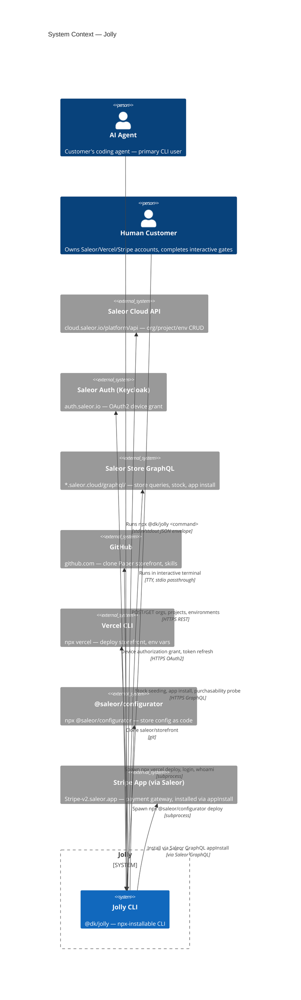
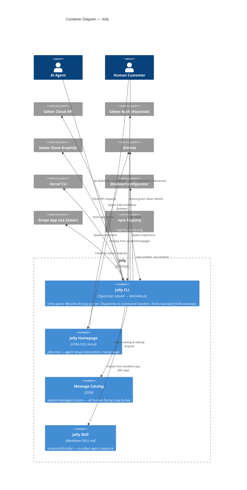
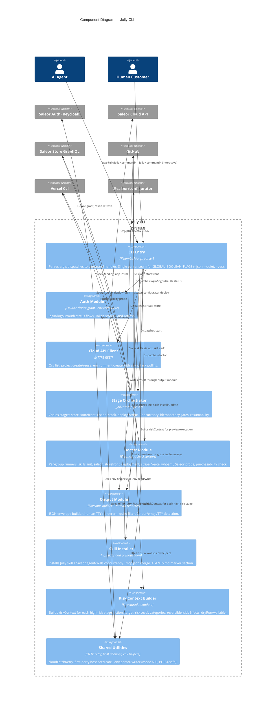
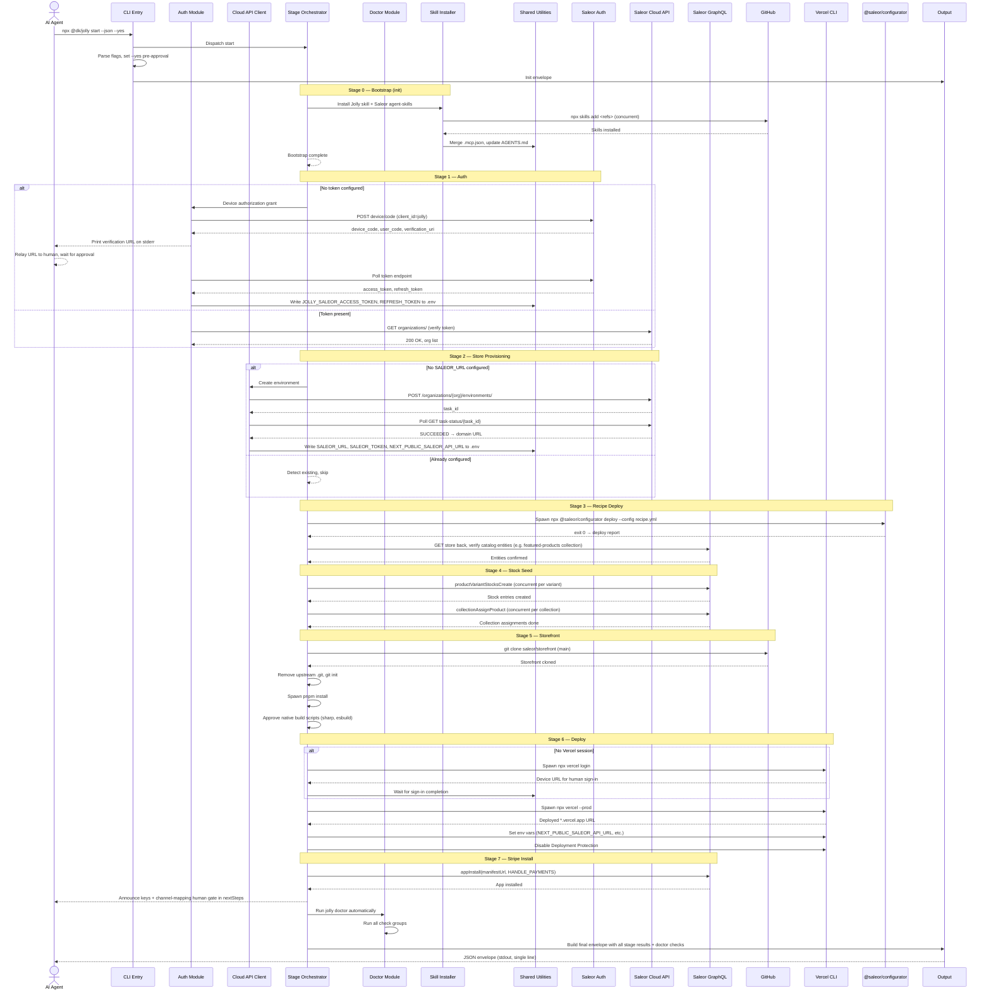

# C4 Model Diagrams — Jolly

Architecture diagrams derived from spec-driven feature files. All diagrams use Mermaid syntax.

---

## 1. Context Diagram (Level 1)

The Jolly system boundary, its two user roles, and the seven external systems it interacts with.



---

## 2. Container Diagram (Level 2)

The Jolly system decomposed into four containers. The CLI is the primary; the homepage, message catalog, and bundled skill are supporting assets.



---

## 3. Component Diagram (Level 3)

The CLI container's internal components.



---

## 4. Dynamic Diagram — `jolly start` Sequence

The end-to-end `jolly start --json --yes` call sequence across all seven stages, showing which component invokes which external system.



---

## 5. Deployment Diagram

Node architecture: where each container runs and how they connect.

```mermaid
C4Deployment
  title Deployment Diagram — Jolly

  Deployment_Node(customer_machine, "Customer Machine", "Node.js >= 20.12.0, any OS") {
    Deployment_Node(npx_env, "npx Execution Environment", "") {
      Container(jolly_cli, "Jolly CLI", "TypeScript → esbuild", "dist/index.js at @dk/jolly")
    }
  }

  Deployment_Node(ci_runner, "Test/CI Runner", "Node.js >= 23, Linux") {
    Deployment_Node(test_env, "Test Environment", "") {
      Container(test_suite, "BDD Test Suite", "Cucumber.js, TypeScript", "features/, step_definitions/, support/")
      Container(eval_agent, "Eval Baseline Agent", "pi-coding-agent", "npx pi --model <model>")
    }
  }

  Deployment_Node(saleor_cloud, "Saleor Cloud", "Saleor-managed infrastructure") {
    Deployment_Node(saleor_api, "Cloud API", "") {
      ContainerDb(cloud_api_db, "Cloud API DB", "Organizations, Projects, Environments")
    }
    Deployment_Node(saleor_auth_node, "Auth Service", "") {
      ContainerDb(auth_db, "Keycloak Realm DB", "saleor-cloud realm, device codes, sessions")
    }
    Deployment_Node(saleor_store, "Store Instance", "*.saleor.cloud") {
      ContainerDb(store_graphql, "Store GraphQL API", "Products, orders, customers, channels")
    }
  }

  Deployment_Node(vercel_edge, "Vercel Edge", "") {
    Deployment_Node(vercel_project, "Vercel Project", "") {
      Container(storefront, "Storefront (Paper)", "Next.js 16, deployed from Paper clone")
    }
    Deployment_Node(homepage_node, "Vercel Project", "") {
      Container(homepage, "Homepage", "jolly.cool — HTML/CSS setup page")
    }
  }

  Deployment_Node(github_node, "GitHub", "") {
    Container(git_repos, "Repositories", "saleor/storefront, dmytri/jolly, saleor/agent-skills")
  }

  Deployment_Node(npm_registry_node, "npm Registry", "registry.npmjs.org") {
      Container(npm_package, "@dk/jolly package", "Published tarball")
  }

  Rel(jolly_cli, npm_package, "npx resolves and downloads")
  Rel(jolly_cli, cloud_api_db, "HTTPS REST")
  Rel(jolly_cli, auth_db, "HTTPS OAuth2 device grant")
  Rel(jolly_cli, store_graphql, "HTTPS GraphQL queries")
  Rel(jolly_cli, git_repos, "git clone")
  Rel(jolly_cli, vercel_project, "Spawned npx vercel deploy")
  Rel(jolly_cli, storefront, "Spawned npx vercel targets Paper")

  Rel(test_suite, jolly_cli, "Invokes in subprocess during @sandbox/@logic tests")
  Rel(eval_agent, jolly_cli, "Invokes during @eval affordance measurement")

  Rel(storefront, store_graphql, "Data queries during runtime")
```

---

## 6. Test Infrastructure Deployment

How the verification suite is structured and deployed on the CI/test runner.

```mermaid
C4Deployment
  title Deployment — Verification Suite

  Deployment_Node(runner, "Test Runner VM", "7.9 GB RAM, Linux, Node.js >= 23") {
    Deployment_Node(jolly_repo, "Jolly Repository", "git clone — clean tree") {
      Container(features, "Feature Files", "Gherkin .feature files", "30 feature files, ~400 scenarios")
      Container(steps, "Step Definitions", "TypeScript", "Cucumber step implementations")
      Container(support, "Support Code", "TypeScript", "Hooks, world, sandbox provision, PTY, plank conformance")
    }

    Deployment_Node(test_profiles, "Cucumber Profiles", "Parallel vs serial execution") {
      Container(logic_profile, "@logic Profile", "Parallel, 4 workers", "Fast assertions — 187 scenarios")
      Container(sandbox_light_profile, "@sandbox Light Profile", "Parallel, 2 workers", "Real-service queries — ~15 scenarios")
      Container(sandbox_heavy_profile, "@sandbox Heavy Profile", "Serial", "Full jolly start, deploys — ~41 scenarios")
      Container(eval_profile, "@eval Profile", "Serial", "Live baseline agent — 3 scenarios")
    }

    Deployment_Node(harness, "Sandbox Harness", "") {
      Container(provisioner, "Environment Provisioner", "Creates/deletes Cloud envs", "jolly-cannon-fodder-<run-id> naming")
      Container(reclaimer, "Capacity Reclaimer", "Scans for leftovers", "BeforeAll: delete leaked jolly-cannon-fodder envs")
      Container(shared_store, "Shared Store Cache", "Persistent marker file", "One store reused across runs, self-heals on 404")
      Container(teardown, "Best-effort Teardown", "AfterAll: remove created resources", "Retries on transient network failure")
    }

    Container(dot_env, ".env Secrets", "git-ignored", "JOLLY_SALEOR_CLOUD_TOKEN, HARNESS_OPENROUTER_API_KEY")
    Container(vercel_session, "Vercel CLI Session", "~/.vercel", "Fitted manually for sandbox and eval tiers")
  }

  Deployment_Node(saleor_org, "Saleor Cloud Org", "Dedicated test organization") {
    ContainerDb(test_envs, "jolly-cannon-fodder-* Environments", "2-slot capacity", "Namespaced, disposable, reclaimed aggressively")
    ContainerDb(shared_env, "Shared Store Environment", "Persistent", "Cached across runs, never reclaimed by name")
  }

  Rel(logic_profile, features, "Reads and runs @logic-tagged scenarios")
  Rel(logic_profile, dot_env, "Reads credentials for real-service @logic checks")
  Rel(sandbox_light_profile, features, "Runs @sandbox (not @heavy) scenarios")
  Rel(sandbox_light_profile, harvester, "Isolated env per worker")
  Rel(sandbox_heavy_profile, features, "Runs @sandbox @heavy scenarios serially")
  Rel(eval_profile, features, "Runs @eval scenarios")
  Rel(eval_profile, vercel_session, "Spawns npx vercel with provided session")

  Rel(provisioner, test_envs, "Creates & polls environments")
  Rel(reclaimer, test_envs, "Deletes leftover cannon-fodder envs")
  Rel(shared_store, shared_env, "Reuses or self-heals")
  Rel(teardown, test_envs, "Deletes after scenario/scenario outline")
```

---

## Legend

```
Shape         Meaning
─────         ───────
Person        A human or AI actor
System        The Jolly system boundary
Container     A deployable unit within Jolly
Component     A logical module within a container
System_Ext    An external system Jolly depends on
ContainerDb   A database or data store

Arrows
──────
──→           Relationship / data flow
..→           Asynchronous or spawned interaction

Tags
────
$tags=""     Used to colour-code: person (orange), system (green),
             external_system (blue), container (green/grey),
             component (green/light)
```
