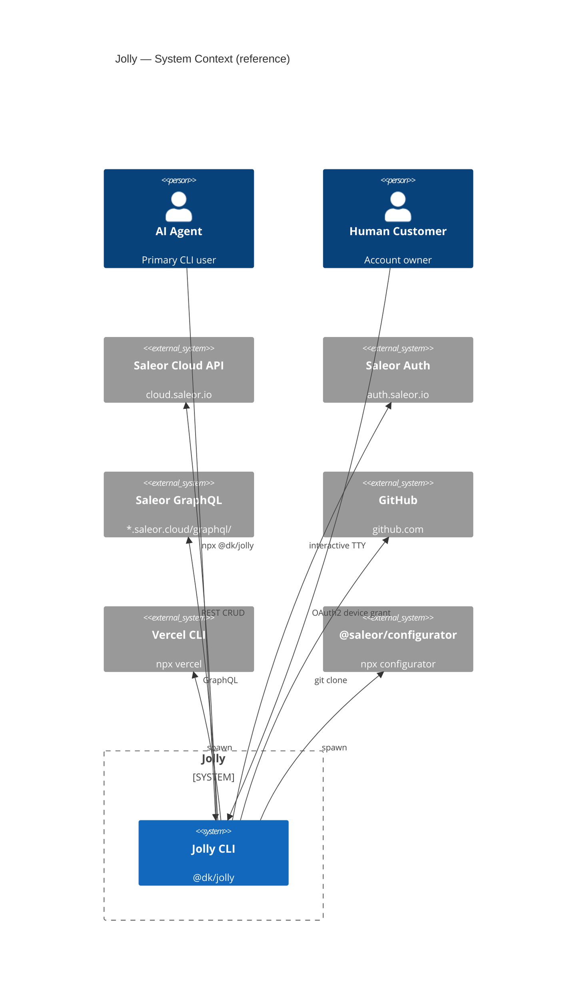
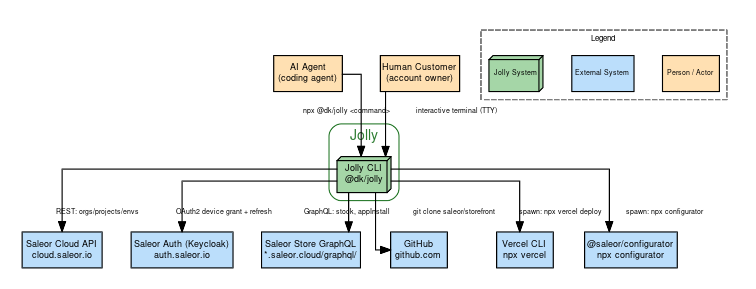
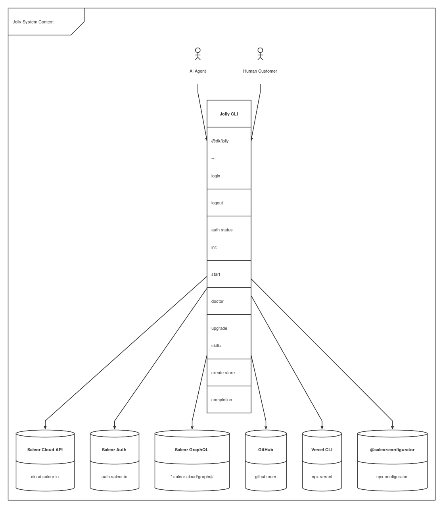

# All Diagram Formats — Rendered for Viewing

- **Sections 1–5**: ASCII/Unicode diagrams — render directly in any terminal viewer (`cat`, `glow`, `leaf`, `flow`)
- **Sections 7–9**: Auto-layout formats rendered to SVG/PNG images — view in browser or `leaf` (Sixel), or open the `.svg` file.
- **Section 6**: Mermaid source — renders natively on GitHub/GitLab.

Render commands used for sections 7–9 are explained inline.

---

## 1. Svgbob — System Context (C4 Level 1)

Source: `svgbob/jolly-context.bob`

```
.-----------------------------------------------------------------------.
(                     Jolly — System Context                            )
`-----------------------------------------------------------------------'

                                     ┌─────────────────────┐
                                     │     AI Agent         │
                                     │ (customer's coding   │
                                     │  agent, primary user)│
                                     └──────────┬──────────┘
                                                │ npx @dk/jolly <command>
                                                │ stdin/stdout JSON envelope
                                                ▼
          ┌─────────────────────────────────────────────────────────────────┐
          │                       Jolly CLI                                 │
          │              @dk/jolly  (npx-installable, esbuild bundle)       │
          │                                                                 │
          │  login | logout | auth status | init | start | doctor           │
          │  upgrade | skills | create store | completion                   │
          └──┬──────┬──────┬──────┬──────┬──────┬──────────────────────────┘
             │      │      │      │      │      │
     ┌───────┤      │      │      │      │      ├───────────┐
     │       │      │      │      │      │      │           │
     ▼       ▼      ▼      ▼      ▼      ▼      ▼           ▼
  ┌──────┐ ┌────┐ ┌────┐ ┌────┐ ┌────┐ ┌────┐ ┌──────────┐
  │Saleor│ │Sale│ │Git │ │pnpm│ │Ver.│ │@sal│ │  Human   │
  │Cloud │ │or  │ │Hub │ │    │ │cel │ │eor.│ │ Customer │
  │API   │ │Auth│ │    │ │    │ │CLI │ │Conf│ │ (account │
  │cloud.│ │auth│ │gith│ │    │ │    │ │ig  │ │  owner)  │
  │saleor│ │sale│ │ub  │ │    │ │    │ │    │ │          │
  │.io   │ │or  │ │    │ │    │ │    │ │    │ │  interac-│
  │      │ │.io │ │    │ │    │ │    │ │    │ │ tive TTY │
  └──────┘ └────┘ └────┘ └────┘ └────┘ └────┘ └──────────┘

.-----------------------------------------------------------------------.
( Legend                                                                )
`-----------------------------------------------------------------------'
  Saleor Cloud API  = cloud.saleor.io/platform/api   (REST CRUD)
  Saleor Auth       = auth.saleor.io                 (OAuth2 device grant)
  GitHub            = github.com                     (git clone storefront)
  pnpm              = storefront package install     (spawn subprocess)
  Vercel CLI        = npx vercel                     (deploy storefront)
  @saleor/Config    = @saleor/configurator           (store config as code)
```

---

## 2. Svgbob — Container Diagram (C4 Level 2)

The Jolly system decomposed into four containers.

```
.-----------------------------------------------------------------------.
(                  Jolly — Container View                               )
`-----------------------------------------------------------------------'

┌──────────────────────────────────────────────────────────────────────────────┐
│                                Jolly                                         │
│  ┌─────────────────────────────────────────────┐  ┌──────────────────────┐  │
│  │         Jolly CLI                            │  │     Jolly Skill      │  │
│  │  @dk/jolly  —  dist/index.js                │  │  SKILL.md            │  │
│  │  login | start | doctor | create store ...   │  │  (bundled playbook)  │  │
│  │         ▲                                    │  │         ▲            │  │
│  │         │           ┌──────────────────────┐  │  │         │            │  │
│  │         │           │  Message Catalog      │  │  │         │            │  │
│  │         │           │  cli.json             │  │  │         │ installs  │  │
│  │         │           │  (copy by key)        │  │  │         │ from      │  │
│  │         └───────────┤                       │  │  │         │ bundled   │  │
│  │                     └──────────────────────┘  │  │         │ copy      │  │
│  └─────────────────────────────────────────────┘  └──────────────────────┘  │
│                                                   ┌──────────────────────┐  │
│                                                   │     Jolly Homepage   │  │
│                                                   │  jolly.cool          │  │
│                                                   │  /setup page         │  │
│                                                   │  (Vercel-deployed)   │  │
│                                                   └──────────────────────┘  │
└──────────────────────────────────────────────────────────────────────────────┘

  Connected to external systems:

  Saleor     Saleor     Saleor       GitHub    Vercel       @saleor      Stripe
  Cloud API  Auth       GraphQL                         configurator   (app)
```

---

## 3. Svgbob — Runtime: `jolly start` Flow

The seven-stage pipeline.

```
.-----------------------------------------------------------------------.
(               jolly start — Stage Pipeline                            )
`-----------------------------------------------------------------------'

  ┌──────────┐    ┌──────┐    ┌────────┐    ┌───────┐    ┌───────────┐
  │ 0.Boot   │───→│1.Auth│───→│2.Store │───→│3.Recipe│───→│4.Stock    │
  │ init     │    │device│    │provision│    │config.│    │seed       │
  │ skills   │    │grant │    │Cloud API│    │deploy │    │Saleor GQL │
  │ .mcp.json│    │      │    │        │    │       │    │           │
  └──────────┘    └──────┘    └────────┘    └───────┘    └───────────┘
                                                              │
                                                              ▼
                    ┌──────────┐    ┌────────┐    ┌──────────────┐
                    │ 7.Stripe │←───│6.Deploy│←───│5.Storefront  │
                    │ app      │    │Vercel  │    │git clone     │
                    │ install  │    │        │    │pnpm install  │
                    │          │    │        │    │              │
                    └──────────┘    └────────┘    └──────────────┘

  ┌─────────────────────────────────────────────────────────────────────┐
  │  Concurrency: stages 2+3 run concurrently with stage 5.             │
  │               Stage 4 stock seeding uses concurrent GQL mutations.  │
  │  Gates:       Stages 2,5,6 require agent approval (riskContext).    │
  │  Human steps: Stage 1 (approve device URL), Stage 6 (Vercel login), │
  │               Stage 7 (paste Stripe keys in Dashboard).             │
  └─────────────────────────────────────────────────────────────────────┘
```

---

## 4. Unicode Box Drawing — Vercel Deploy Sequence

A sub-section of the architecture with richer unicode box styles.

```
                    Vercel Deploy Flow

  ┌─────────────────────────────────────────────────────────────┐
  │   jolly start — Deploy Stage                                │
  │                                                             │
  │  1. Check Vercel session                                    │
  │     │                                                       │
  │     ├── No session → npx vercel login                       │
  │     │                 └── Print device URL → human          │
  │     │                 └── Wait for sign-in                   │
  │     │                                                       │
  │     └── Session OK → skip                                   │
  │                                                             │
  │  2. npx vercel --prod  (spawn)                              │
  │     │                                                       │
  │     ├── ─ ─ ─ set env vars ─ ─ ─ > Vercel Project           │
  │     │       NEXT_PUBLIC_SALEOR_API_URL                      │
  │     │       NEXT_PUBLIC_DEFAULT_CHANNEL                     │
  │     │                                                       │
  │     └── ─ ─ ─ disable deploy protection ─ ─ > Vercel        │
  │                                                             │
  │  3. Real deployed *.vercel.app URL captured                 │
  │     from Vercel CLI output (never fabricated)               │
  └─────────────────────────────────────────────────────────────┘
```

---

## 5. Unicode Box Drawing — Auth Flow (Device Grant)

The OAuth2 device authorization grant flow.

```
             Saleor Device Authorization Grant

  ┌──────────┐          ┌──────────────┐          ┌──────────────┐
  │  Jolly   │          │  Saleor Auth  │          │    Human     │
  │  CLI     │          │  (Keycloak)   │          │  (browser)   │
  └────┬─────┘          └──────┬───────┘          └──────┬───────┘
       │                      │                         │
       │  POST device/code    │                         │
       │  client_id=jolly     │                         │
       ├─────────────────────→│                         │
       │                      │                         │
       │  device_code         │                         │
       │  user_code: ABC-DEF  │                         │
       │  verification_uri    │                         │
       │←─────────────────────┤                         │
       │                      │                         │
       │  Print URL on stderr │                         │
       │  Relay to human      │                         │
       ├────────────────────────────────────────────────→│
       │                      │                         │
       │                      │                         │  Open URL
       │                      │                         │  Approve
       │                      │←────────────────────────┤
       │                      │                         │
       │  POST token          │                         │
       │  grant_type=device   │                         │
       │  device_code=...     │                         │
       ├─────────────────────→│                         │
       │                      │                         │
       │  access_token (JWT)  │                         │
       │  refresh_token       │                         │
       │←─────────────────────┤                         │
       │                      │                         │
       │  Write to .env:      │                         │
       │  JOLLY_SALEOR_ACCESS_TOKEN                     │
       │  JOLLY_SALEOR_REFRESH_TOKEN                    │
       │                      │                         │
```

---

## 6. Mermaid — Source Reference

Mermaid does not render in terminal markdown viewers, but the source is embeddable in markdown and renders on GitHub/GitLab. The full C4 diagrams in Mermaid are at `../c4-diagrams.md`.



---

## 7. Graphviz DOT — System Context (rendered to PNG)

Source: `dot/jolly-context.dot`

This format uses auto-layout (Graphviz is the gold standard for graph layout). It cannot be embedded directly as text in markdown — it needs the `dot` binary to render.

**How it was rendered:**
```bash
# Install graphviz (apt) OR use npx fallback:
sudo apt install graphviz
dot -Tsvg dot/jolly-context.dot > dot/jolly-context.svg

# Or without root (what we did here):
npx --yes graphviz-cli dot/jolly-context.dot -Tsvg > dot/jolly-context.svg

# Convert SVG to PNG for markdown compatibility:
convert dot/jolly-context.svg dot/jolly-context.png
```



---

## 8. D2 — System Context (rendered to PNG)

Source: `d2/jolly-context.d2`

D2 has native C4 shape support (`shape: person`, `shape: cloud`) and beautiful ELK auto-layout. Rendered via the D2 CLI binary (Go, no JVM).

**How it was rendered:**
```bash
# Download D2 binary (no root needed):
wget https://github.com/terrastruct/d2/releases/download/v0.6.8/d2-v0.6.8-linux-amd64.tar.gz
tar xzf d2-v0.6.8-linux-amd64.tar.gz
./d2-v0.6.8/bin/d2 --layout=elk d2/jolly-context.d2 d2/jolly-context.svg

# Or install globally:
curl -fsSL https://d2lang.com/install.sh | sh -s

# Convert SVG to PNG:
convert d2/jolly-context.svg d2/jolly-context.png
```


---

## 9. Nomnoml — System Context (rendered to PNG)

Source: `nomnoml/jolly-context.nomnoml`

Nomnoml is a simple indentation-based DSL for UML-like diagrams. Runs via `npx` — no installation needed.

**How it was rendered:**
```bash
# One npx command — no installation:
npx nomnoml nomnoml/jolly-context.nomnoml nomnoml/jolly-context.svg

# Convert SVG to PNG:
convert nomnoml/jolly-context.svg nomnoml/jolly-context.png

# Or output to stdout (SVG XML):
npx nomnoml nomnoml/jolly-context.nomnoml
```



---

## Summary: Which format for which viewer

| # | Diagram section | Format | `cat` | `glow` | `leaf` | GitHub | Tools needed |
|---|---|---|---|---|---|---|---|---|
| 1 | System Context | Svgbob | ✓ perfect | ✓ good | ✓ good | ✓ (as text) | none |
| 2 | Container View | Svgbob | ✓ perfect | ✓ good | ✓ good | ✓ (as text) | none |
| 3 | Stage Pipeline | Svgbob | ✓ perfect | ✓ good | ✓ good | ✓ (as text) | none |
| 4 | Vercel Sequence | Unicode | ✓ perfect | ✓ may wrap | ✓ good | ✓ (as text) | none |
| 5 | Auth Sequence | Unicode | ✓ perfect | ✓ may wrap | ✓ good | ✓ (as text) | none |
| 6 | System Context | Mermaid | ✗ (raw) | ✗ | ✓ (JS) | ✓ (native) | mermaid render |
| 7 | System Context | Graphviz DOT | ✗ | ✗ | ✓ (Sixel) | ✓ (PNG) | `dot` + `convert` |
| 8 | System Context | D2 | ✗ | ✗ | ✓ (Sixel) | ✓ (PNG) | `d2` binary + `convert` |
| 9 | System Context | Nomnoml | ✗ | ✗ | ✓ (Sixel) | ✓ (PNG) | `npx nomnoml` + `convert` |

**Svgbob + Unicode** are the only formats that render perfectly in **every** viewer with **zero tooling**. They are hand-laid-out but require no render pipeline.

**Graphviz DOT** is the best auto-layout option for terminal: write `.dot` source, then render to either `-Tascii` (always-works) or `-Tsvg` (colour + rich format). No JVM needed (`dot` is native C, or use `npx graphviz-cli` as we did).

**D2** has the richest built-in shape library (C4 person/cloud/container) but needs its own binary and SVG image viewing. Best for browser-based docs.

**Nomnoml** is the simplest to render — one `npx nomnoml` command, no install — but has the most basic output quality.
